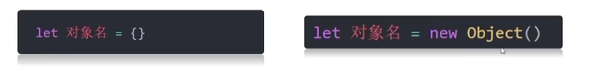

# 什么是对象

* JavaScript里的一种数据类型
* 可以理解为一种无序的数据集合，注意数组是有序集合
* 用来描述某个事物

# 对象使用

## 声明对象语法



# 对象组成

* 属性

<pre class="vditor-reset" placeholder="" contenteditable="true" spellcheck="false"><p data-block="0"></p><p data-block="0"></p><p data-block="0"></p></pre>

* 方法

本质是函数

```
let obj={
	uname=:'刘德华',
	//方法
	song: function(){
		console.log('冰雨');
		}
}
```

# 遍历对象

```
  let obj = {
            uname: 'andy',
            age: 18,
            gender: '男'
        }
        // 遍历对象
        // 对象是无序的 无法通过索引号实现
        // 用 in 有点像python 
        for (let k in obj) {
            console.log(k) //打印属性名 'uname' 'age' ，k是字符串
            // console.log(obj.name);
            // console.log(obj['name']);
            console.log(obj[k]) //打印属性值
        }
```

# 内置对象

* JavaScript内部提供的对象，包含各种属性和方法给开发者调用

document.write( )

console.log( )

............

## Math

* 介绍：Math对象是JavaScript提供的一个'数学'对象
* 作用：提供了一系列做数学运算的店方法
* Math对象包含的方法有：
  * random：生成0-1之间的随机数（包含0不包括1） ,利用数学运算例如*10可以得到0-10随机数
  * ceil:向上取整
  * floor:向下取整
  * max:找最大数
  * min:找最小数
  * pow:幂运算
  * abs:绝对值
  * [在线文档](https://developer.mozilla.org/zh-CN/docs/Web/JavaScript/Reference/Global_Objects/Math)
