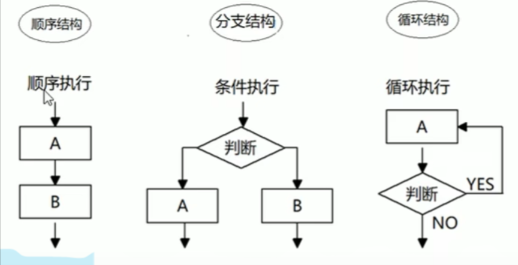

# 是流程控制?

控制代码按照一定的顺序结构执行

---

流程控制主要有

## 三种结构



### 1.顺序结构

### 2.分支结构

目标

- 能够使用if分支语句
- 能够使用switch分支语句
- 能够使用三元表达式

#### if

```html
if (条件表达式) {
            //执行语句
        }
else if (条件表达式) {
            //执行语句
}
else{
            //执行语句
}
```

##### 三元表达式

```html
//条件表达式？ 表达式1 : 表达式2
//如果条件表达式为真 返回表达式1的值 否则2 

var num=5;
var result= num > 5 ? 'yes' : 'not' ;
console.log(result);//not
```

#### switch

switch (表达式) {
            case value1:
                执行语句1;
                break;

    case value2:
                执行语句2;
                break;
            ...
            default:
                执行最后的语句;
        }

#### if 和switch 区别

1.一般情况下，它们两个语句可以相互替换

2.switch...case 语句通常处理case为比较确定值的情况

    而if...else...语句更加灵活，常用于**范围判断**（大于、等于某个范围）

3.switch语句进行条件判断后直接执行到程序的条件语句，效率更高

    而if...else语句有几种条件，就得判断多少次

4.当分支比较少时，if...else的语句执行效率比switch语句高

### 3.循环结构

#### for

目标

- 能够说出循环的目的
- 能够说出for循环的执行过程
- 能够使用断点调试来观察代码的执行过程
- 能够使用for循环我完成累加求和等案例
- 能够使用双重for循环完成乘法表案例
- 能够说出while循环和do while循环的区别
- 能够说出 break和 continue 的区别

#### while
