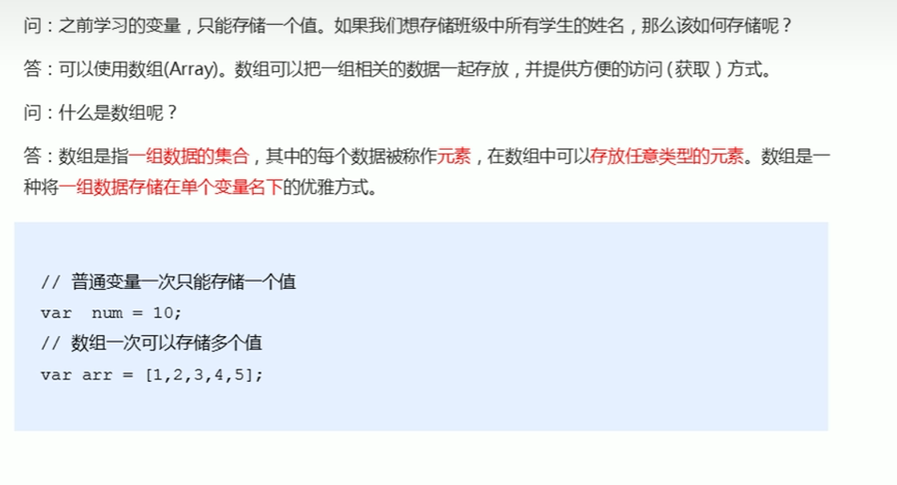

# 目标

* 知道为什么要有数组
* 能够创建数组
* 能够获取数组中的元素
* 能够对数组进行遍历
* 能够给数组新增一个元素
* 能够独立完成冒泡排序的算法

# 什么是数组（概念）



# 创建数组

JS创建数组有两种方式

* new

```
var 数组名 = new Array ();
```

* 数组字面量

```
var 数组名 = ['值1','值2','值3'];
```

# 获取数组中的元素

索引(下标)

**数组下标从0开始**

```
var arr1=[1,2,'你好',true];
console.log(arr1[1]); //2
```

遍历数组

```
for(var i=0;i<4;i++){
	console.log(arr1[i]);
}
```

# 数组长度

数组名.length

```
console.log(arr1.length) //4
```
