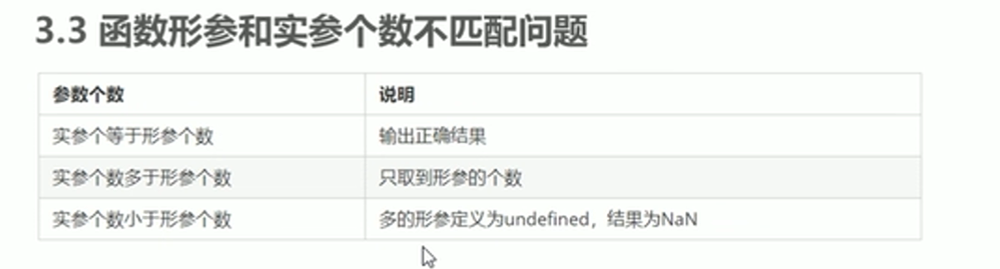

# 目标

* 能够说出为什么需要函数
* 能够根据语法书写函数
* 能够根据需求封装函数
* 能够说出实参和形参的传递过程
* 能够使用函数的返回值
* 能够使用arguments获取函数的参数



* 函数没有returen时返回undefined

# arguments的使用

当不确定多少参数要传递时，可以使用arguments获取。在JavaScript中，arguments实际上是当前函数的一个内置对象。所有函数都内置了一个arguments对象，arguments对象中存储了传递的所有实参。

## 伪数组

* 不是真正意义上的数组
* 具有数组的length属性
* 按照索引的方式进行存储
* 没有真正数组的一些方法——pop( ) push( )...

```
function fn()
{
console.log(arguments);
console.log(arguments[2];) //3
}
fn(1,2,3);
```

# 函数的两种声明方式

1.关键字自定义函数

function fn(){

}

2.匿名函数

* 函数表达式

var 变量名= function( ){}

---

//fun 是变量名 不是函数名

var fun=function( ){

    console.log('我是函数表达式');

}

* 立即执行函数

(function( 形参){ })(实参 )

可以避免全局变量之间相互污染
