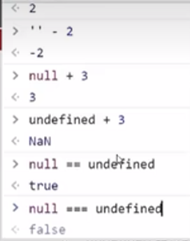

逻辑运算符里的短路

* 短路：只存在于 && 和 || 中,当满足一定条件会让右边代码不执行

console.log(false && age++); //false

console.log(1 || age++); //1

console.log(11 && 22); //22 都是真 返回最后一个真值

console.log(11 || 22\)； // 11 都是真 返回第一个真值

x=x || 0;// 设默认值0

