# 1. 从http://study.doule.game:801/study/study.git 克隆项目
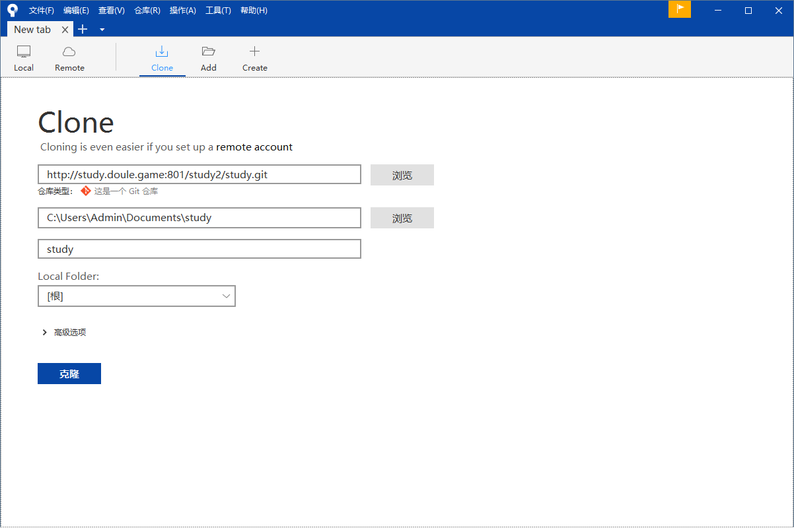

# 2. 创建以 你名字的拼音全拼 命名的分支，从 master 分支创建并切换到你创建的分支
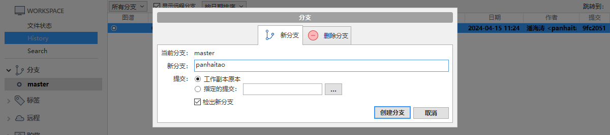
# 3. 创建 conflict.txt 并在其中写入以 YYYY-MM-DD HH:mm:ss 格式的日期时间字符串，例如 2021-06-25 13:56:00 
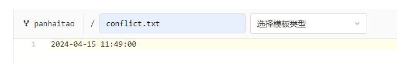
# 4. 创建一个包含此文件的提交，提交说明为 创建文件 conflict.txt 
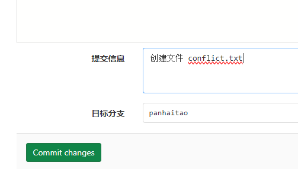
# 5. 发布之前你创建的分支，把它推送到服务器上
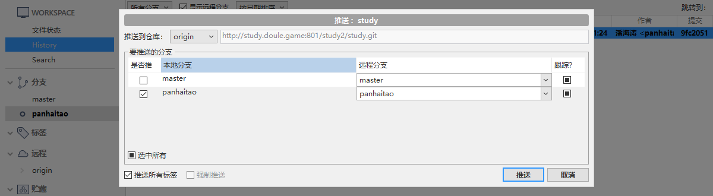
# 6. 假如你名叫 Alice ，那么你应当可以看到本地存在一个 Alice 分支，而服务器上存在 remote/Alice 分支，以下的操作均以此说明，实际操作时使用 你名字的拼音全拼
# 7. 编辑 conflict.txt 文件，重新写入当前的时间
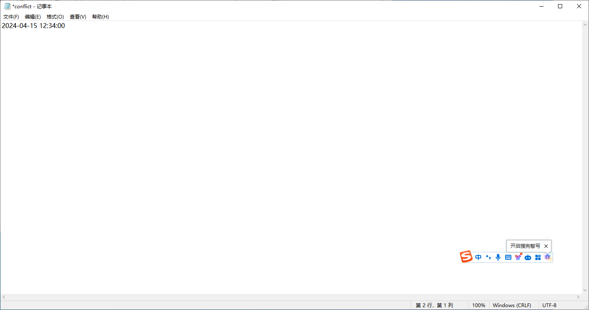
# 8. 使用 贮藏 功能，创建一个贮藏，同时使你的工作区保持干净
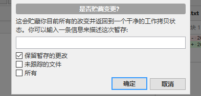
# 9. 基于 Alice 分支创建一个分支，名为 Alice_test
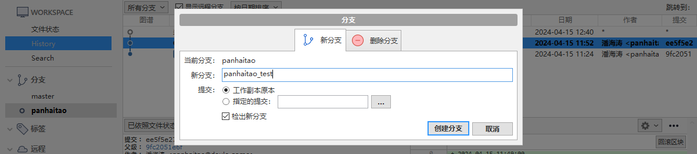
# 10. 应用你之前创建的贮藏，创建一次提交，提交说明为 修改文件 conflict.txt 
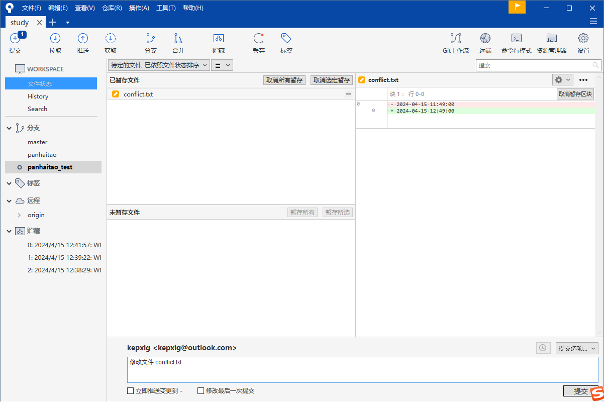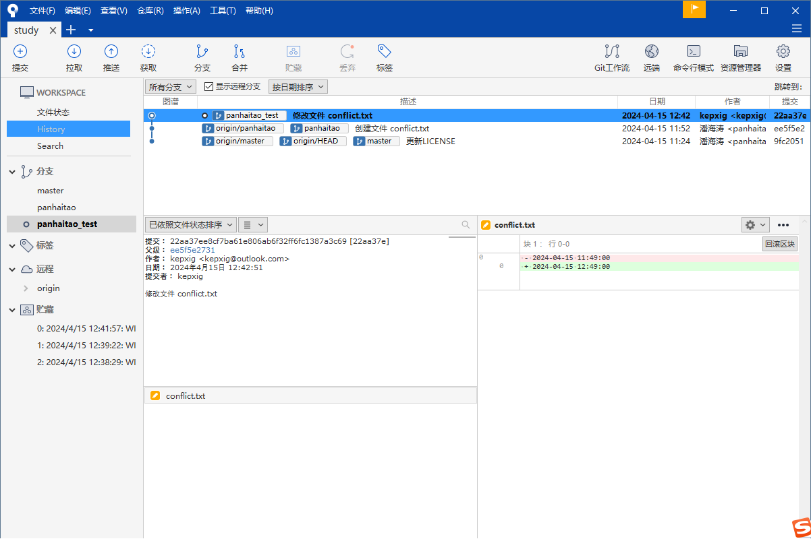
# 11. 切换回 Alice 分支，重新将当前的时间写入 conflict.txt ，创建一次提交，提交说明为 修改文件 conflict.txt
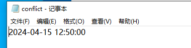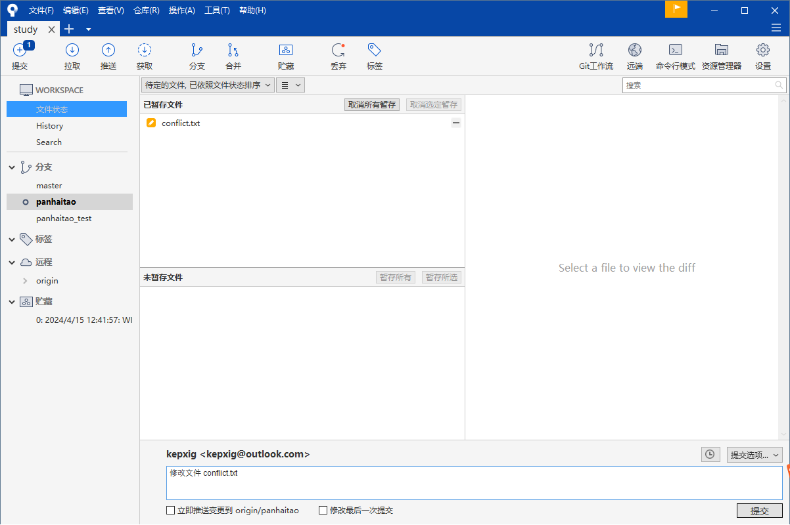
# 12. 将 Alice_test 分支合并到 Alice 分支，以他人的版本解决冲突，冲突解决后， conflict.txt 中的内容应当是 Alice_test 分支中的内容
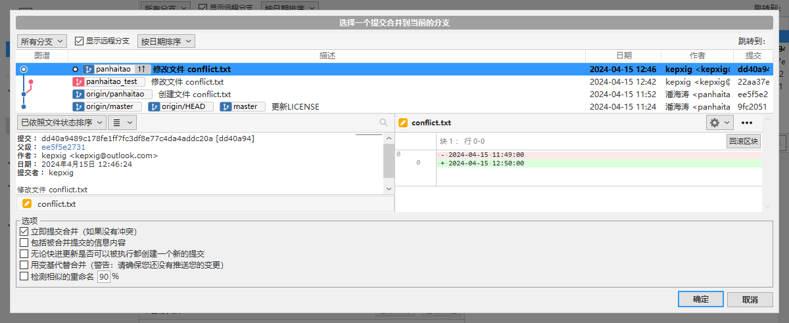   
# 13. 删除 Alice_test 分支
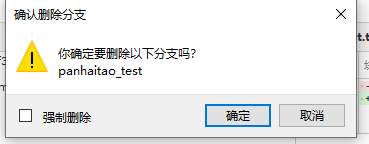
# 14. 创建文件 rollback_reset.txt ，内容为 测试重置和回滚 

# 15. 创建一个包含此文件的提交，提交说明为 创建文件 rollback_reset.txt 
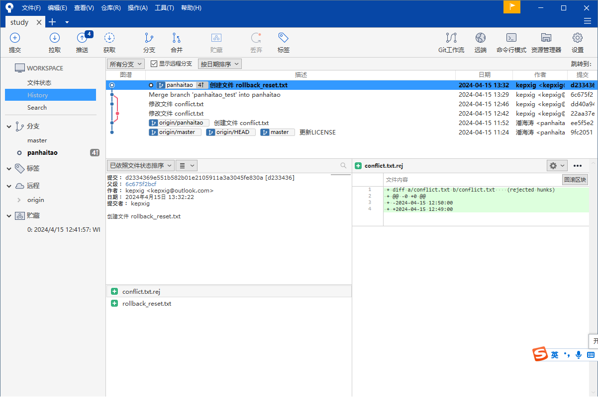
# 16. 推送 Alice 分支到服务器
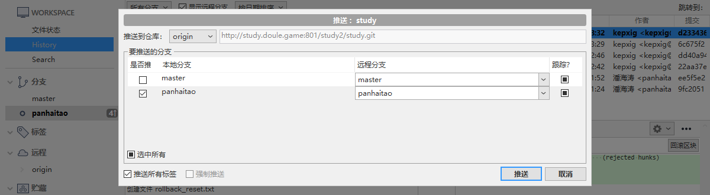
# 17. 编辑 rollback_reset.txt 文件，清空它的内容
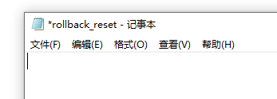
# 18. 创建一次提交，提交说明为 修改文件 rollback_reset.txt 

# 19. 回滚你在第18步创建的提交

# 20. 推送 Alice 分支到服务器
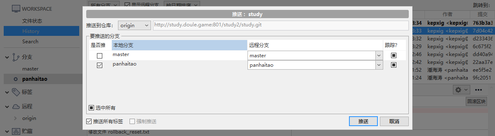
# 21. 硬重置 Alice 分支到 创建文件 rollback_reset.txt 
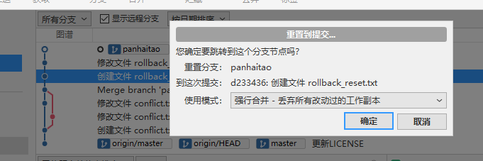
# 22. 编辑 rollback_reset.txt 文件，内容为 测试回滚和重置 
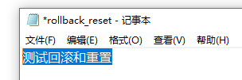
# 23. 创建一次提交，提交说明为 修改文件 rollback_reset.txt 

# 24. 尝试推送 Alice 分支到服务器，说明为什么无法推送
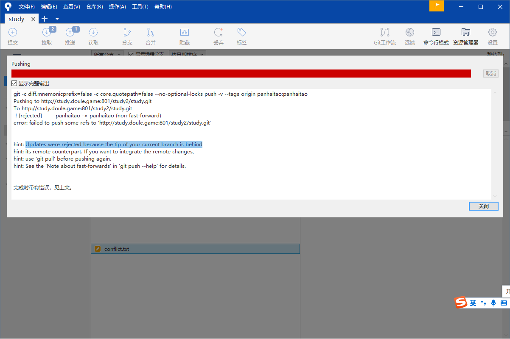
更新被拒绝，因为当前分支的落后与远程分支
# 25. 拉取 Alice 分支，解决冲突时以本地的文件为准

# 26. 再次尝试推送 Alice 分支到服务器
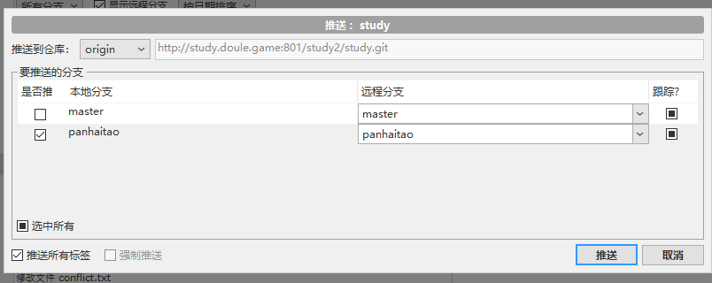
# 27. 创建文件 test.txt、1.test、2.test，创建目录test，在test目录下创建1.txt、2.bin
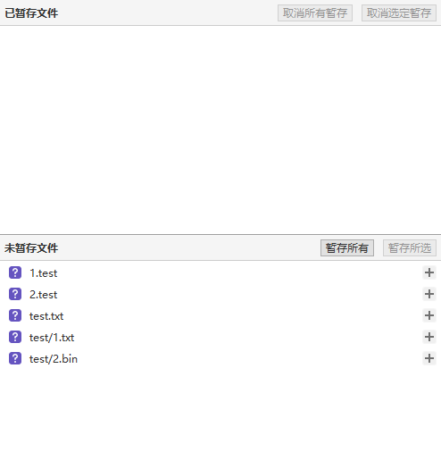
# 28. 忽略以.test为扩展名的文件以及test目录下的所有文件
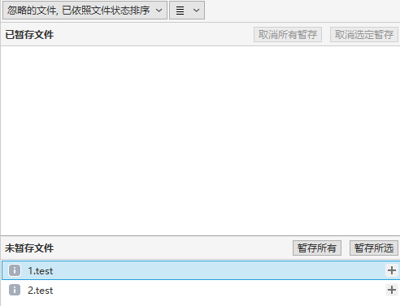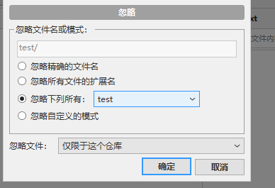
# 29. 推送分支  
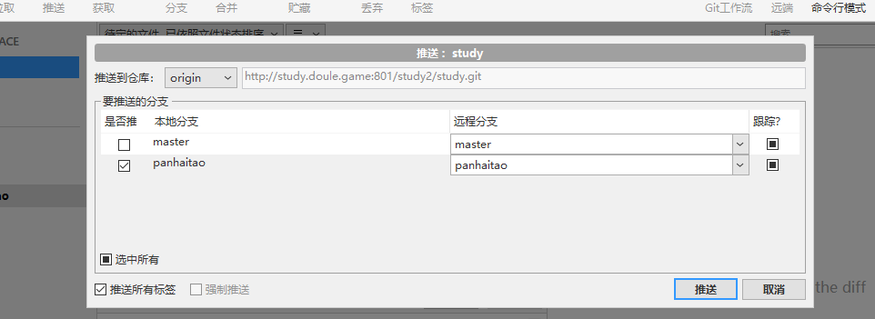